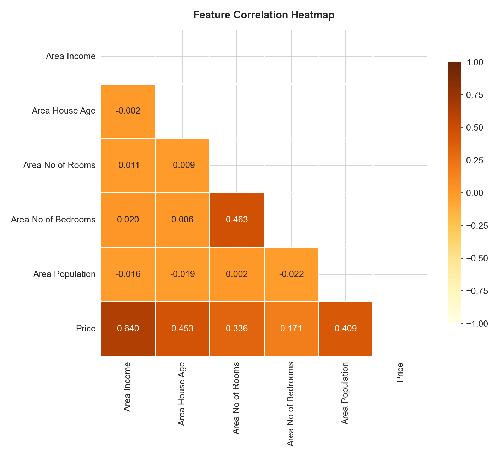
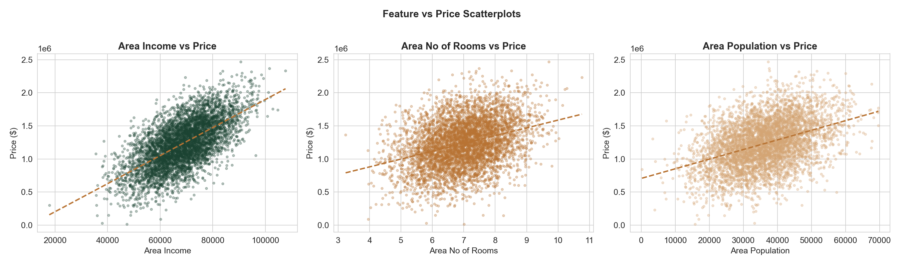
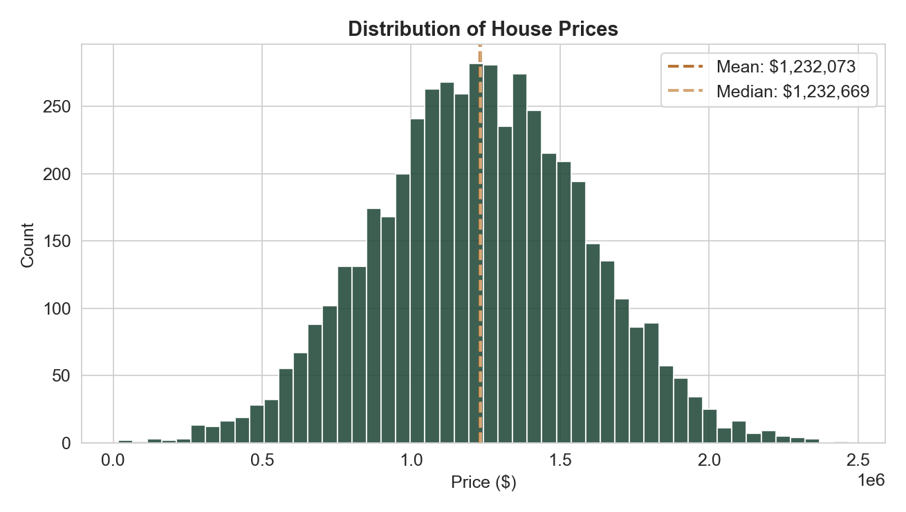

<div align="center">

# `HOUSE PRICE ESTIMATOR`

**Know what a home is worth before you even visit**


*Enter a few neighborhood details. Get a home price estimate in seconds.*

[](https://house-price-prediction-vhgo.onrender.com/)

</div>

---

## 🎯 About

> [!IMPORTANT]
> **Model Training Notebook**: The exact pipeline used to train this Linear Regression model is available in the [Jupyter Notebook (train_model.ipynb)](notebook/train_model.ipynb). This notebook contains the raw training and evaluation code with no comments or annotations.

This is a full-stack house price estimator that takes in five simple neighborhood characteristics and returns a predicted home value, powered by a Linear Regression model trained on 5,000 real US housing records. No sign-ups, no API keys, no nonsense.

You type in numbers like average area income and house age, hit a button, and watch the price animate into view with an easing counter that genuinely feels satisfying. The model handles everything behind the scenes: scaling your inputs, running them through the trained regression, and even telling you how confident it is about the prediction.

The whole thing runs on a FastAPI backend that loads the model once at startup and never touches the disk again. The frontend is hand-crafted HTML, CSS, and JavaScript with a custom Forest Green + Warm Stone + Copper color palette that looks nothing like a default Bootstrap template.

> [!NOTE]
> The model achieves an **R² score of 0.918**, meaning it explains 91.8% of the variance in house prices. That is genuinely strong for a single linear regression with five features.


## 🌐 Live Demo

<div align="center">

[](https://house-price-prediction-vhgo.onrender.com/)

*Try it yourself - enter a few numbers and watch the estimate roll in.*

</div>

> [!NOTE]
> This app is hosted on Render's free tier, which spins down after periods of inactivity. If it's been idle for a while, the first request may take 30-50 seconds to wake the server up - every request after that is instant.


## ✨ Features

### 🏠 Core Prediction Engine

- 🔥 **Instant Price Estimation** - Enter five neighborhood metrics, get a dollar-value home price prediction within milliseconds. The model was trained on 5,000 data points and achieves 91.8% accuracy.

- 📊 **Confidence Assessment** - Every prediction comes with a confidence tag. The system checks each of your inputs against the typical ranges from the training data and flags when values are unusual. You get "High", "Moderate", or "Low" so you know how much to trust the number.

- 🧮 **StandardScaler Preprocessing** - Your raw inputs are normalized using the exact same scaler that was fitted on training data. This prevents data leakage and ensures the model sees inputs in the format it was trained on.

> [!TIP]
> The confidence system is not just a label. It actually loops through each feature, checks if it falls within the typical ranges of the training data, and counts how many fields are out of range. Zero out of range = High. One or two = Moderate. Three or more = Low.

### 🎨 UI & Experience

- 🎯 **Animated Price Counter** - The predicted price does not just appear. It counts up from zero using an `easeOutCubic` timing function over 1.2 seconds. It respects the user's `prefers-reduced-motion` system setting.

- ✅ **Field-Level Validation** - Every input is validated individually. Error messages are contextual ("Average Area Income is required", "Must be between 0 and 500,000"). Errors clear automatically as you type.

- 🌿 **Custom Design System** - Forest Green (#1B4332), Warm Stone (#D4A574), and Copper (#B87333) with DM Serif Display for headings and Inter for body text. No CSS framework. Every pixel is intentional.

- 📱 **Fully Responsive** - Works cleanly on desktop, tablet, and mobile. The two-column layout stacks to single-column on small screens, the sticky result card becomes static, and font sizes scale with `clamp()`.

- 📈 **SVG Regression Chart** - The "How it Works" section includes a hand-crafted SVG scatter plot with training data points and a regression trendline, visually explaining what the model is doing.

### ⚡ Backend & API

- 🚀 **Singleton Model Loading** - The model, scaler, and feature names are loaded exactly once at server startup via FastAPI's lifespan context manager. Every subsequent request reads from memory. Zero redundant disk I/O.

- 🛡️ **Pydantic Schema Validation** - Every request is validated against strict Pydantic schemas with min/max constraints before it ever reaches the model. Bad input gets a clean 422 response with human-readable error messages.

- 🌐 **Global Error Handler** - Unhandled exceptions never leak raw stack traces to the client. A catch-all returns clean JSON with a generic message.

- 📄 **Auto-Generated API Docs** - FastAPI provides Swagger UI at `/docs` out of the box. Every endpoint is documented with examples, descriptions, and response models.

> [!TIP]
> The API is designed so the frontend can be served directly by FastAPI via `StaticFiles`, but also works standalone if opened as a local HTML file - it detects `file://` origins and falls back to `localhost:8000`.


## 🛠️ Built With

| Technology | What it does in this project |
|---|---|
|  | The backbone - runs the training script, the API server, and all data processing |
|  | Trains the LinearRegression model and fits the StandardScaler on training data |
|  | Serves the prediction API with automatic validation, docs, and CORS handling |
|  | ASGI server that runs FastAPI in production with async support |
|  | Loads, explores, and cleans the 5,000-row housing dataset |
|  | Handles feature arrays and numerical operations during prediction |
|  | Generates all EDA plots - heatmaps, scatter plots, histograms |
|  | Adds statistical styling and the correlation heatmap visualization |
|  | Semantic page structure with accessible form inputs and ARIA labels |
|  | Custom design system with CSS variables, responsive grid, and micro-animations |
|  | Handles form validation, API calls, state management, and the animated price counter |

The stack was chosen deliberately: scikit-learn for a clean, interpretable model. FastAPI because it auto-generates docs and validates inputs with zero extra code. Vanilla frontend because this project does not need 200KB of React to render five input fields.


## 📸 Model Training Visualizations

These plots are generated automatically when you run the training script. They live in `notebook/plots/`.

<div align="center">

### Correlation Heatmap


*<sub>Area Income dominates with a 0.640 correlation to Price. Bedrooms show a weak 0.171 - likely due to multicollinearity with total rooms.</sub>*

<br/>

### Feature vs Price Scatter Plots


*<sub>Income shows a tight linear trend. Rooms are positive but scattered. Population is noisy but still contributes to the full model.</sub>*

<br/>

### Price Distribution


*<sub>Near-perfect bell curve centered at $1.23M. The normal distribution validates the linear regression assumptions.</sub>*

</div>


## ⚙️ Technical Details

### 📁 Project Structure

```
House_Price_Prediction/
├── data/
│   └── housing.csv                # 5,000-row USA Housing dataset
├── notebook/
│   ├── train_model.ipynb          # EDA, cleaning, training, evaluation
│   └── plots/                     # Saved EDA figures used in this README
│       ├── correlation_heatmap.png
│       ├── scatterplots.png
│       └── price_distribution.png
├── model/
│   ├── house_price_model.pkl      # Trained LinearRegression model
│   ├── scaler.pkl                 # Fitted StandardScaler
│   ├── feature_names.pkl          # Ordered feature list used at inference
│   └── metrics.pkl                # Saved RMSE / R² from evaluation
├── app/
│   ├── main.py                    # FastAPI app, routes, CORS, lifespan
│   ├── model_loader.py            # Singleton loader for model + scaler
│   ├── schema.py                  # Pydantic request/response models
│   └── __init__.py
├── frontend/
│   ├── index.html
│   ├── style.css
│   ├── script.js
│   └── favicon.svg
├── requirements.txt
└── README.md
```

### 🧠 Model Details

| | |
|---|---|
| **Dataset** | USA Housing dataset (Kaggle-style), 5,000 rows, no missing values |
| **Features used** | Area Income, Area House Age, Area No of Rooms, Area No of Bedrooms, Area Population |
| **Dropped column** | `Address` (free-text, no predictive value for a regression model) |
| **Train/test split** | 80% / 20%, `random_state=42` for reproducibility |
| **Model** | scikit-learn `LinearRegression` on `StandardScaler`-scaled features |
| **RMSE (test set)** | ≈ $100,444 |
| **R² (test set)** | 0.918 |

**What the coefficients mean** (fit on unscaled data for direct interpretation, holding all other features constant):

- **Area Income**: +$21.65 in predicted price for every +$1 in average area income. Small per-dollar effect, but income has the widest range of any feature, so it ends up driving the most variance overall - consistent with its 0.640 correlation with price.
- **Area House Age**: +$164,666 for every additional year of average house age in the area. This looks counterintuitive at first (older houses are usually cheaper), but at the *area* level it more likely reflects that older, more established neighborhoods carry a location premium - this dataset predicts area-level averages, not individual property condition.
- **Area No of Rooms**: +$119,624 per additional average room. The single strongest structural driver of price in this model.
- **Area No of Bedrooms**: +$2,440 per additional average bedroom - a much smaller effect than rooms. This is expected: bedrooms are a subset of total rooms, so once "Rooms" is in the model, "Bedrooms" carries little extra information (the weak 0.171 correlation with price noted above is the same multicollinearity effect surfacing again).
- **Area Population**: +$15.27 per additional resident. Small individual effect, real at scale given population values in the tens of thousands.

> [!NOTE]
> **Limitation**: Linear Regression assumes linear, additive relationships between features and price. It also can't natively express uncertainty - the "confidence" shown in the UI is a heuristic based on whether inputs fall within the training data's typical range, not a statistical confidence interval. A tree-based model (Random Forest, Gradient Boosting) would likely capture nonlinear effects and interactions the current model misses, at the cost of the direct, plain-English coefficient interpretation above.

### 🔌 API Reference

Full interactive docs are auto-generated at [`/docs`](https://house-price-prediction-vhgo.onrender.com/docs) (Swagger UI) - the reference below is the same information in plain text.

**`GET /health`**

```json
{
  "status": "healthy",
  "model_loaded": true,
  "model_type": "LinearRegression"
}
```

**`POST /predict`**

Request body:
```json
{
  "area_income": 68583.11,
  "area_house_age": 5.98,
  "area_no_of_rooms": 6.99,
  "area_no_of_bedrooms": 3.98,
  "area_population": 36163.52
}
```

Response:
```json
{
  "predicted_price": 1232072.65,
  "formatted_price": "$1,232,073",
  "confidence": "High"
}
```

All five fields are required and range-checked server-side (e.g. `area_income` must be between 0 and 500,000). Invalid input returns a `422` with a field-level error message instead of reaching the model.

### 💻 Local Setup

```bash
# 1. Clone the repo
git clone https://github.com/yash5123/House_Price_Prediction.git
cd House_Price_Prediction

# 2. Install dependencies
pip install -r requirements.txt

# 3. Run the API locally
uvicorn app.main:app --reload
```

The app will be live at `http://127.0.0.1:8000` - the frontend is served automatically at `/frontend/index.html`, and the API docs at `/docs`.


### 🚀 Deployment

This project is deployed on **Render** as a single web service - FastAPI serves both the `/predict` and `/health` API routes *and* the static frontend (via `StaticFiles`), so there's only one service to deploy, not two.

| Setting | Value |
|---|---|
| **Build command** | `pip install -r requirements.txt` |
| **Start command** | `uvicorn app.main:app --host 0.0.0.0 --port $PORT` |
| **Runtime** | Python 3.11+ |
| **Plan** | Free tier (spins down after inactivity - see the note in the Live Demo section above) |


### 🧩 Environment & Versions

| Package | Version |
|---|---|
| fastapi | 0.136.1 |
| uvicorn | 0.46.0 |
| scikit-learn | 1.8.0 |
| pandas | 2.3.3 |
| numpy | 2.4.2 |
| joblib | 1.5.3 |
| matplotlib | 3.10.7 |
| seaborn | 0.13.2 |

> [!TIP]
> The scikit-learn version above must match between training and serving - a mismatch can cause `joblib.load()` to fail or silently change predictions if you retrain the model in a different environment.


<div align="center">

### Made by Yash


</div>